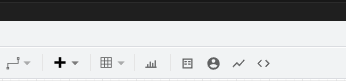
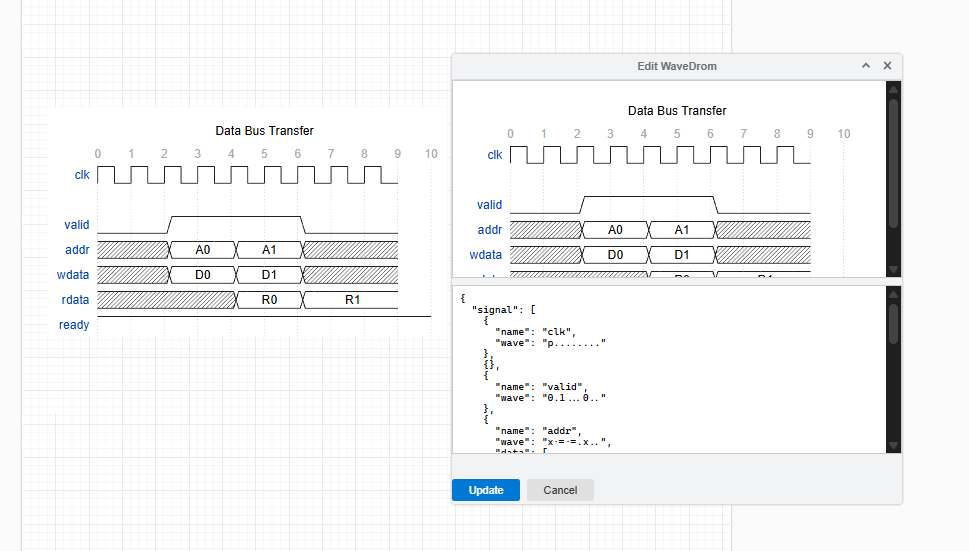
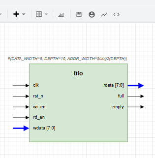
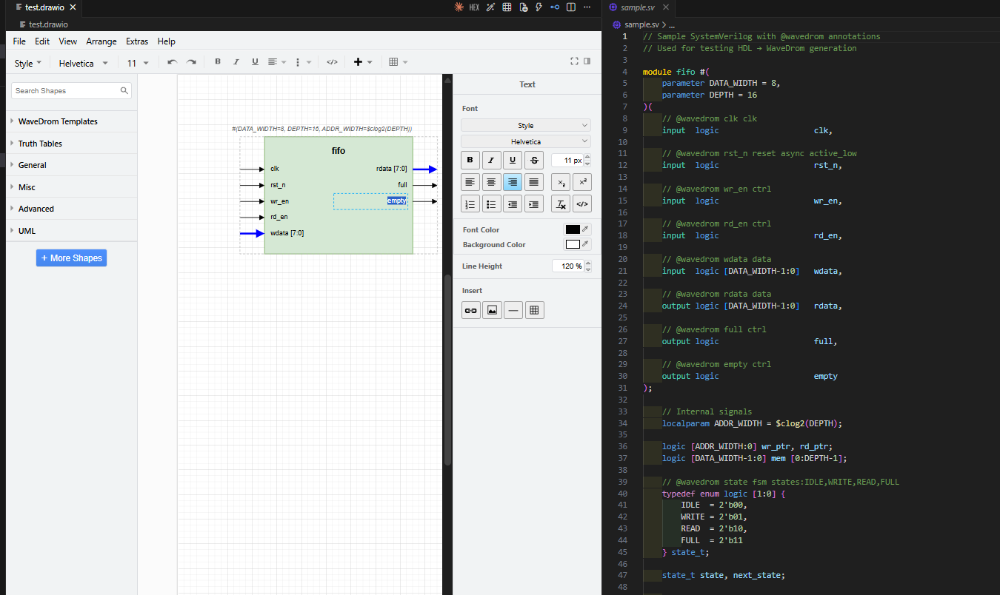

# DrawWave

**Integrated draw.io + WaveDrom + HDL design environment for VS Code**

DrawWave combines [draw.io](https://www.diagrams.net/) block diagrams and [WaveDrom](https://wavedrom.com/) timing diagrams in a single VS Code extension, with HDL-driven automation for RTL design documentation.

## Features



### WaveDrom Timing Diagram Preview

- Open `.wavedrom.json` files with a live-rendered SVG preview
- Edit JSON source and see changes in real time
- Export diagrams as SVG or PNG

### draw.io Block Diagram Editor

- Full-featured offline draw.io editor embedded in VS Code
- Open and edit `.drawio` / `.dio` files
- WaveDrom shapes rendered directly on the draw.io canvas
- Double-click any WaveDrom shape to edit its JSON and re-render

### Draw.io WaveDrom Editor



- Edit WaveDrom shapes directly within draw.io diagrams
- Live JSON preview and SVG rendering
- Drag templates onto canvas and customize timing behavior

### Template Library (31 templates)

Drag-and-drop WaveDrom templates available in the draw.io sidebar:

| Category | Templates |
|---|---|
| **Basic Digital** | Clock + Reset, Clock Enable, Data Bus, Interrupt |
| **Logic Gates & FF** | D-FF, JK-FF, T-FF, SR Latch, D Latch, AND/OR/NOT, NAND/NOR/XOR, MUX/DEMUX, Tri-State Buffer |
| **Bus Protocols** | AXI4 Write, AXI4 Read, AXI4-Lite, AHB, SPI, I2C, UART |
| **FSM** | Simple FSM, Protocol FSM |
| **Memory** | SRAM Read, SRAM Write, DDR Burst |
| **Pipeline** | 3-Stage Pipeline, Pipeline Stall, Pipeline Forwarding |
| **Handshake** | Valid/Ready, Req/Ack, Credit-Based |

Additionally, 8 truth table shapes (AND, OR, XOR, NAND, NOR, Half Adder, 2:1 MUX, 3-Input Majority) are available in the sidebar.

### Truth Table Generator

- Generate truth tables from boolean expressions (e.g., `A & B`, `A ^ B | C`)
- Insert truth tables as draw.io table shapes

### HDL → WaveDrom Generation

- Parse Verilog / SystemVerilog files and auto-generate WaveDrom timing diagrams
- Detects clock, reset, control, data, and FSM signals
- Supports `@wavedrom` annotation comments in HDL

### Module Port Diagram



- Parse HDL module declarations and generate draw.io block diagrams
- Inputs on the left, outputs on the right
- Bus widths annotated, color-coded arrows

### Module Hierarchy Diagram

- Visualize hierarchical relationships between Verilog/SystemVerilog modules
- Auto-detect module instantiations and generate tree diagrams
- Navigate complex multi-module designs

### FSM State Transition Diagram

- Extract `typedef enum` + `case` statements from SystemVerilog
- Generate state transition diagrams with conditions on arrows
- Reset state highlighted in red

### VCD Waveform Import

- Import IEEE 1364 VCD (Value Change Dump) files
- Select signals to include via multi-pick UI
- Edit generated WaveDrom JSON before inserting
- Convert to WaveDrom JSON file or insert directly into draw.io

### File Link



- Pick HDL or VCD files via VS Code file picker
- Pass selected file path to draw.io WaveDrom editor for processing

## Installation

### From .vsix file

1. Download the `.vsix` file from [Releases](https://github.com/MameMame777/DrawWave/releases)
2. In VS Code: Extensions panel → `···` → **Install from VSIX...**

Or from the command line:

```bash
code --install-extension drawwave-0.1.0.vsix
```

### Build from source

```bash
git clone https://github.com/MameMame777/DrawWave.git
cd DrawWave
npm install
npm run setup-drawio      # Download draw.io webapp (required)
npm run generate-library  # Generate WaveDrom template library
npm run compile
```

Then press **F5** in VS Code to launch the Extension Development Host.

To package as `.vsix`:

```bash
npx @vscode/vsce package
```

## Usage

### WaveDrom Preview

1. Create or open a `.wavedrom.json` file
2. Click the preview icon in the editor title bar, or run **DrawWave: Open WaveDrom Preview** from the command palette

Example `.wavedrom.json`:

```json
{
  "signal": [
    { "name": "clk",  "wave": "p........" },
    { "name": "data", "wave": "x.=.=.=.x", "data": ["A", "B", "C"] },
    { "name": "valid","wave": "0.1...0.." }
  ]
}
```

### draw.io Editor

1. Create or open a `.drawio` file
2. Drag WaveDrom templates from the sidebar into the diagram
3. Double-click a WaveDrom shape to edit its timing JSON
4. Use the toolbar buttons for additional features:
   - **Insert WaveDrom** — add a new WaveDrom shape
   - **Module Port** — generate a port diagram from HDL
   - **FSM Diagram** — extract and render state transitions
   - **VCD Import** — load simulation waveforms
   - **HDL → WaveDrom** — generate timing from HDL source

### Command Palette

All commands are prefixed with `DrawWave:`:

| Command | Description |
|---|---|
| Open WaveDrom Preview | Open `.wavedrom.json` file in live SVG preview mode |
| Open Draw.io Editor | Open or create `.drawio` diagram with WaveDrom integration |
| Insert WaveDrom Template | Browse and insert templates from library (31 templates) |
| Generate WaveDrom from HDL | Parse Verilog/SystemVerilog and auto-generate timing diagram |
| Insert Truth Table | Create truth table from boolean expression (e.g., `A & B \| C`) |
| Module Port Diagram | Generate block diagram showing module ports and I/O |
| Module Hierarchy Diagram | Generate tree diagram of module instantiation hierarchy |
| FSM State Transition Diagram | Extract FSM from SystemVerilog and visualize state transitions |
| Import VCD Waveform | Import simulation `.vcd` file and convert to WaveDrom |
| Export as SVG | Export current diagram as SVG vector image |
| Export as PNG | Export current diagram as PNG raster image |

## File Associations

| Extension | Editor |
|---|---|
| `.wavedrom.json` | WaveDrom Preview (custom editor) |
| `.drawio`, `.dio` | draw.io Editor (custom editor) |

## Requirements

- VS Code 1.85.0 or later
- No external dependencies required (draw.io and WaveDrom are bundled)

## Technology Stack

- **Language**: TypeScript (strict mode)
- **Platform**: VS Code Extension API
- **Diagram Engine**: draw.io (Apache 2.0)
- **Waveform Engine**: WaveDrom (MIT)
- **Build**: TypeScript Compiler (`tsc`)
- **Package**: `@vscode/vsce`

## License

This project is licensed under the **GNU General Public License v3.0** — see [LICENSE](LICENSE) for details.

GPL-3.0 is required due to the bundling of draw.io components.

### Third-Party Licenses

| Component | License | URL |
|---|---|---|
| draw.io (diagrams.net) | Apache 2.0 | https://github.com/jgraph/drawio |
| WaveDrom | MIT | https://github.com/wavedrom/wavedrom |

For detailed license information, see [THIRD_PARTY_LICENSES.md](THIRD_PARTY_LICENSES.md).

## Contributing

1. Fork and clone the repository
2. `npm install`
3. `npm run setup-drawio` (download draw.io webapp - required for first setup)
4. `npm run generate-library` (generate WaveDrom template library)
5. `npm run watch` (auto-compile on save)
6. Press **F5** to launch Extension Development Host
7. Test with files in `test/fixtures/`

## Acknowledgments

- [jgraph/drawio](https://github.com/jgraph/drawio) — The draw.io diagramming tool
- [wavedrom/wavedrom](https://github.com/wavedrom/wavedrom) — Digital timing diagram rendering
